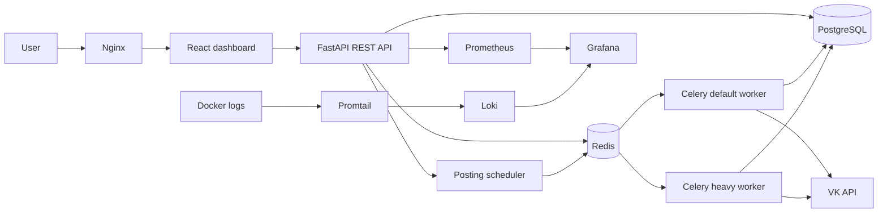

# VK Service Posting

A full-stack service for collecting VK clips, organizing content pipelines, and scheduling automated publication across VK communities.

The project demonstrates a production-oriented Python backend with asynchronous REST APIs, background processing, persistent task state, containerized deployment, and application monitoring.

> This repository is intended as a technical portfolio project. Use VK automation responsibly and in accordance with the platform's rules.

## What the service does

VK Service Posting provides a web dashboard for managing an automated content workflow:

- connect and manage VK accounts, communities, and proxies;
- collect clips from selected source communities;
- filter clips by publication date and view count;
- organize content into reusable clip lists and categories;
- configure posting workers and publication frequency;
- execute long-running operations through Celery queues;
- track task status, posting activity, and operational events;
- export collected clip data;
- monitor API metrics and container logs.

## Architecture



The API uses asynchronous SQLAlchemy sessions for request processing. Celery workers use synchronous database sessions for blocking background workflows. Separate `default` and `heavy` queues prevent expensive media and VK operations from blocking routine tasks.

## Main features

### Content pipeline

- VK community registration and source parsing
- clip collection through the VK API
- duplicate prevention and persistent parsing status
- filtering by date and minimum view count
- clip lists, categories, and posting workflows
- scheduled selection and publication of content

### Account and access management

- user registration and login
- JWT authentication stored in cookies
- bcrypt password hashing
- Fernet encryption for sensitive account data
- VK account, community, and proxy management
- account health and flood-control state

### Background processing

- Redis-backed Celery broker and result backend
- dedicated queues for regular and resource-intensive tasks
- persistent task records and live activity events
- VK account connection and validation workflows
- source parsing, token refresh, and scheduled posting

### Operations

- PostgreSQL migrations with Alembic
- Docker Compose deployment
- Gunicorn with Uvicorn workers
- Prometheus API metrics at `/metrics`
- Grafana dashboards with Prometheus and Loki data sources
- centralized Docker logs through Promtail and Loki

## Technology stack

| Area | Technologies |
| --- | --- |
| Backend | Python 3.11, FastAPI, Pydantic |
| Data | PostgreSQL 15, SQLAlchemy 2, asyncpg, Alembic |
| Background jobs | Celery 5, Redis 7 |
| Authentication | JWT, bcrypt, Fernet |
| Frontend | React 19, Vite, Ant Design, Tailwind CSS, Axios |
| Runtime | Docker, Docker Compose, Gunicorn, Uvicorn, Nginx |
| Observability | Prometheus, Grafana, Loki, Promtail |
| Integrations | VK API, Selenium/Chromium, yt-dlp |

## Repository structure

```text
.
??? VK Service Posting/
?   ??? src/
?   ?   ??? api/              # FastAPI routers and dependencies
?   ?   ??? celery_app/       # Celery configuration and tasks
?   ?   ??? migrations/       # Alembic migrations
?   ?   ??? models/           # SQLAlchemy models
?   ?   ??? repositories/     # Data-access layer
?   ?   ??? schemas/          # Pydantic schemas
?   ?   ??? services/         # Business logic
?   ?   ??? vk_api_methods/   # VK integration layer
?   ?   ??? config.py
?   ?   ??? database.py
?   ?   ??? main.py
?   ??? vk_api/               # Vendored VK API client package
?   ??? Dockerfile
?   ??? alembic.ini
?   ??? requirements.txt
??? VK Service Posting frontend/
?   ??? vk_service_posting/   # Dashboard V1
?   ??? vk_service_posting_v2/# Dashboard V2
?   ??? Dockerfile
??? grafana/
??? redis/
??? docker-compose.yml
??? prometheus.yml
??? loki-config.yaml
??? promtail-config.yaml
```

## Quick start with Docker Compose

### Requirements

- Docker Engine
- Docker Compose v2
- at least 4 GB of available RAM

### 1. Clone the repository

```bash
git clone https://github.com/nGrUnD/vk_service_posting.git
cd vk_service_posting
```

### 2. Create the environment files

Create a root `.env` file:

```dotenv
DB_NAME=vk_service_posting
DB_HOST=postgres
DB_PORT=5432
DB_USER=postgres
DB_PASS=change-me

postgres_user=postgres
postgres_password=change-me
postgres_db=vk_service_posting

REDIS_PASSWORD=replace-with-a-long-random-secret

GRAFANA_ADMIN_USER=replace-with-a-non-default-admin-name
GRAFANA_ADMIN_PASSWORD=replace-with-a-long-random-secret

JWT_SECRET_KEY=replace-with-a-long-random-secret
JWT_ALGORITHM=HS256
JWT_ACCESS_TOKEN_EXPIRE_MINUTES=1440

FERNET_SECRET_KEY=replace-with-a-valid-fernet-key
API_KEY_2CAPTCHA=

APP_CORS_ORIGINS=http://localhost:5173,http://localhost:5174
```

The backend container reads variables from `VK Service Posting/.env`, while Docker Compose also uses the root file for PostgreSQL interpolation. Copy the same file:

```bash
cp .env "VK Service Posting/.env"
```

Redis receives its password from `REDIS_PASSWORD` at container startup. Keep `redis/redis.conf` free of credentials.

Generate a Fernet key with:

```bash
python -c "from cryptography.fernet import Fernet; print(Fernet.generate_key().decode())"
```

Never commit real credentials, VK tokens, cookies, proxy passwords, or production secrets.

### 3. Build and start the stack

```bash
docker compose up --build -d
```

The backend container applies Alembic migrations before starting Gunicorn.

Check service status and logs:

```bash
docker compose ps
docker compose logs -f backend celery-default celery-heavy
```

### 4. Open the services

| Service | URL |
| --- | --- |
| Web dashboard | http://localhost:8080 |
| Dashboard V2 | http://localhost:8080/v2/ |
| REST API | http://localhost:8000 |
| Swagger UI | http://localhost:8000/docs |
| OpenAPI schema | http://localhost:8000/openapi.json |
| Prometheus | http://localhost:9090 |
| Grafana | http://localhost:3001 |
| Loki | http://localhost:3100 |

Grafana reads its administrator credentials from `GRAFANA_ADMIN_USER` and `GRAFANA_ADMIN_PASSWORD`. Docker Compose refuses to start Grafana when either value is missing.

### 5. Stop the stack

```bash
docker compose down
```

To also remove persistent database and monitoring volumes:

```bash
docker compose down -v
```

## Local development

Start PostgreSQL and Redis:

```bash
docker compose up -d postgres redis
```

Run the backend:

```bash
cd "VK Service Posting"
python -m venv .venv
source .venv/bin/activate
pip install -r requirements.txt
alembic upgrade head
uvicorn src.main:app --reload
```

On Windows, activate the environment with:

```powershell
.venv\Scripts\Activate.ps1
```

Run the V2 frontend in another terminal:

```bash
cd "VK Service Posting frontend/vk_service_posting_v2"
npm ci
npm run dev
```

## API overview

FastAPI generates interactive documentation at `/docs`. The main route groups are:

| Route group | Purpose |
| --- | --- |
| `/auth` | registration, login, logout, authenticated-user checks |
| `/users/{user_id}/vk_accounts` | VK account management and account workflows |
| `/users/{user_id}/vk_group` | source and destination community management |
| `/users/{user_id}/clip_list` | clip lists, collection, export, and download jobs |
| `/users/{user_id}/dashboard` | posting activity, task state, and live operational events |
| `/metrics` | Prometheus metrics |

Additional routers manage categories, proxies, account-to-community relationships, tools, and posting workers.

## Data and task flow

1. A user connects VK accounts and configures proxies.
2. Source communities are assigned to a clip list.
3. Celery workers collect and filter clips and persist new items in PostgreSQL.
4. Categories define the clip list and hourly publication limit.
5. The scheduler selects eligible posting workflows every minute.
6. Publication jobs are sent to Redis and processed by Celery workers.
7. Task state, publication results, and operational events are stored for the dashboard.
8. Prometheus and Loki expose runtime signals through Grafana.

## Deployment notes

Before exposing the service publicly:

- replace all default database, Redis, Grafana, JWT, and encryption secrets;
- restrict CORS to trusted origins;
- terminate TLS through Nginx or another reverse proxy;
- keep PostgreSQL, Redis, Prometheus, and Loki bound to private interfaces;
- configure Docker volume backups;
- review VK API usage limits and platform requirements;
- use a dedicated production settings file or secret manager.

## Author

**Semen Teneshev** ? Python Backend Developer

GitHub: [@nGrUnD](https://github.com/nGrUnD)